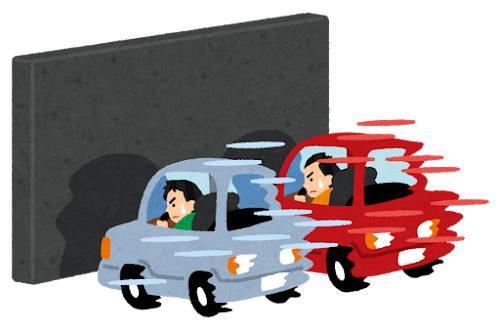

# 量子チキンレースアプリ

## 概要
量子チキンレースアプリは、ブロッホ球上のチキンを量子ゲートを使って走らせることで、量子コンピューティングの基本的な概念を学ぶための量子アプリです。家族や友達と一緒にチキンレースをしながら、量子コンピューティングの基礎概念を楽しく学ぶことができます。

## ルール
- チキンの位置はブロッホ球上の量子状態ベクトルで表現されます。
- 量子ゲートでチキンを次の位置に移動させます。
- 何度もチキンを移動させて、最終的にチキンを一番ゴールに近づれられた人の勝ちです！
- ただし、移動距離が一定距離（初期設定は4π）を超えると「ドボン」となり、負けが確定します。気をつけて！
- 量子ゲートの種類と効果は以下の通りです。
  - Xゲート: チキンをx軸周りにπ回転させます。
  - Yゲート: チキンをy軸周りにπ回転させます。
  - Zゲート: チキンをz軸周りにπ回転させます。
  - Hゲート: チキンをx軸とz軸の中間の軸周りにπ回転させます。

## ライセンス

MITライセンスの下で公開されています。詳細は[LICENSE](./LICENSE)を参照してください。

## 謝辞

- [Quantum Computing for You: The Second Chance](https://prtimes.jp/main/html/rd/p/000000008.000077636.html)の取り組みの中で誕生したアプリです。
- [いらすとや](https://www.irasutoya.com/)の画像を使用しています。
- アプリのデプロイには[Streamlit Community Cloud](https://streamlit.io/cloud)を使用しています。
